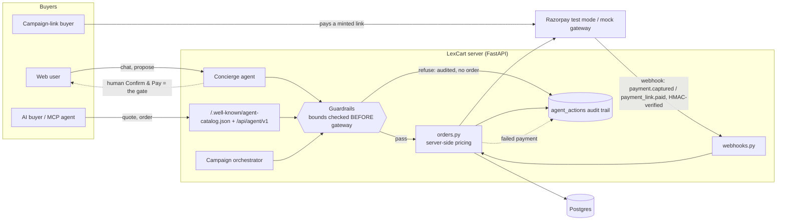

# LexCart — Agentic Commerce for a Legal-Services Merchant

**Razorpay Buildathon submission · Track 01: AI Growth & Agentic Commerce**

[](https://github.com/anubhab7111/lexcart/actions/workflows/eval.yml)

> Anyone can let an AI spend money. LexCart shows how a merchant lets AI spend money *safely* — bounded before the gateway is ever called, gated behind a human or a verified webhook, and audited end to end.

LexCart is an Indian legal-services marketplace (book consultations with verified lawyers) rebuilt as an **agent-native merchant** on Razorpay test-mode APIs. It grows the merchant's revenue with an in-app buying agent, and makes the merchant transactable by external AI buyers end to end — including autonomous MCP-connected agents.

## What it does (track mapping)

| Track direction | What LexCart ships |
|---|---|
| **Conversational in-app checkout** | A concierge agent (`Concierge` tab) that understands a legal need in plain language, finds the right lawyer, builds a cart, and completes a Razorpay payment — behind an explicit human gate. |
| **Agent-readable catalog** | `/.well-known/agent-catalog.json` — an open, schema.org-flavoured discovery document (services, prices, bounds, auth) — plus an authenticated `/api/agent/v1` surface (quote → order → pay → status). `demo/ai_buyer.py` is an autonomous buyer that transacts end to end. |
| **Upsell & cross-sell agent** | The concierge proposes relevant add-ons (document review, follow-up call, written opinion, notice draft) per specialty; the web checkout surfaces the same recommendations. |
| **Campaign orchestrator** | An agent drafts promo campaigns (name, segment, message) within discount/budget caps; the merchant approves or rejects; approval mints a Razorpay payment link and conversions/spend are tracked against the budget. |

### The bar: explainable, bounded, gated

- **Explainable** — every money-touching agent step (catalog search, upsell, checkout proposal, order, payment, refusal) writes an `agent_actions` row with a plain-language rationale. Users see their own trail (`/api/concierge/audit`); the merchant sees everything (Merchant tab → Audit trail).
- **Bounded** — server-side caps checked *before* any Razorpay order exists: per-order cap (₹25,000), per-user daily agent-spend cap, per-AI-buyer-key daily limit, campaign discount ≤30% and budget caps. Refusals are audited with the exact rule and numbers.
- **Gated** — the concierge can only *propose* a checkout (`gate_status=pending`); the order is created solely by the user's **Confirm & Pay** click. Campaigns go live only on explicit merchant approval.
- **Failure handled gracefully** — a failed/dismissed payment marks the order failed, audits it, tells the user nothing was booked, and offers a retry ("Simulate failed payment" button demos this live). The AI-buyer demo's `--over-budget` mode shows the merchant refusing an out-of-bounds order and the buyer adapting.

## Architecture

- `client/` — React + Vite. New: `Concierge.tsx` (chat + cart + gate), `MerchantDashboard.tsx` (audit/campaigns/AI-buyer info/growth panel), Razorpay checkout.js in `Payment.tsx` + `lib/razorpay.ts`.
- `server/` — FastAPI.
  - `app/services/razorpay_gateway.py` — one wrapper for all money movement: real Razorpay test mode when `RAZORPAY_KEY_ID/SECRET` are set, otherwise a **mock gateway** with identical code paths (labeled ids, same HMAC verify, same webhook-signature verify) so everything runs with zero keys.
  - `app/commerce/` — `guardrails.py` (bounds), `audit.py` (trail), `orders.py` (server-side pricing + order lifecycle + refunds; clients never dictate amounts), `concierge.py` (the buying agent: local LLM for language understanding, deterministic code for everything that touches money).
  - `app/routers/` — `bookings.py` (create-order → verify), `concierge.py` (chat/confirm/reject/audit), `agent_commerce.py` (AI-buyer API: quote/order/pay/status/cancel, idempotent), `campaigns.py`, `webhooks.py` (Razorpay `payment.captured` / `payment_link.paid`), `merchant.py` (revenue/growth stats).
- `demo/` — `ai_buyer.py` (autonomous CLI buyer over the AI-buyer API), `mcp_server.py` (the same buyer surface exposed as MCP tools for any MCP-speaking agent), `evaluate.py` (the self-evaluation harness — see below).
- Inherited from the LawWeb base: RAG legal chatbot (LangGraph + FAISS over Indian bare acts), lawyer directory with pgvector semantic matching, auth, bookings — see `CLAUDE.md`.



The one line that matters: **every arrow into `ORD` (the only place money moves) passes through `GATE` first**, and every outcome — pass or refuse — lands in `AUDIT`.

## Quickstart

Prereqs: PostgreSQL, conda env `legal_chatbot_env` (Python 3.14), Node 18+, Ollama with `qwen3:4b` (optional — the agent degrades gracefully to deterministic parsing without it).

```bash
# one-time DB setup
sudo -u postgres psql -c "CREATE ROLE lawweb LOGIN PASSWORD 'lawweb' CREATEDB;"   # if missing
psql -U postgres -h 127.0.0.1 -c "CREATE DATABASE lexcart OWNER lawweb;"
psql -U postgres -h 127.0.0.1 -d lexcart -c "CREATE EXTENSION IF NOT EXISTS vector;"

# backend
cp server/.env.example server/.env       # fill JWT_SECRET; Razorpay keys optional (mock mode without)
cd server
pip install -r requirements.txt
python -m app.db.init_db                 # tables + lawyers + addons + demo AI-buyer key
python backfill_lawyer_embeddings.py     # semantic lawyer matching
python run.py                            # http://localhost:8000 (docs at /docs)

# frontend
cd client && npm install && npm run dev  # http://localhost:5173
```

With real test keys: put `rzp_test_...` values in `server/.env` — the web/concierge checkouts open Razorpay checkout.js, and the AI-buyer API returns payment links. Without keys, the mock gateway runs the same order → signature-verify → booking flow headlessly.

## Demo walkthrough (3 minutes)

1. **Concierge checkout**: sign up → Concierge tab → *"I need help with a property dispute, budget under ₹4000"* → select the match → accept the Document Review upsell → *"checkout"* → the agent proposes (bounds note shown) → **Confirm & Pay** → booking confirmed. Try **Simulate failed payment** to see the graceful failure.
2. **AI buyer**: `python demo/ai_buyer.py --need "property dispute" --budget 4000` — discovery → quote → order → paid booking, headless. Add `--over-budget` to watch the merchant refuse and the buyer adapt.
3. **Merchant control room**: Merchant tab → the full audit trail of everything above; draft a campaign (try discount 60% to see the bounds refusal), approve one, and watch its payment link + conversion tracking.

## API surface for AI buyers

```
GET  /.well-known/agent-catalog.json          # open discovery (no auth)
GET  /api/agent/v1/catalog                    # X-Agent-Key
POST /api/agent/v1/quote                      # {serviceId, addonIds} -> firm line items
POST /api/agent/v1/orders                     # {..., buyerReference?} -> order; idempotent on buyerReference
POST /api/agent/v1/orders/{id}/pay-mock       # mock mode only; 403 with real keys
GET  /api/agent/v1/orders/{id}                # status
POST /api/agent/v1/orders/{id}/cancel         # refund a paid order in full

POST /api/webhooks/razorpay                   # payment.captured / payment_link.paid, HMAC-verified
GET  /api/merchant/stats                      # revenue by channel, agentic share, upsell rate, campaign ROI
```

Demo key (seeded by `init_db`): `lexcart_agent_demo_a7f3e9c1`, daily limit ₹50,000.

Retrying `POST /api/agent/v1/orders` with the same `buyerReference` returns the original order (`idempotent: true`) instead of double-charging — the safe pattern for an agent that can't tell whether its last request actually landed.

## MCP: LexCart as an agent tool

`demo/mcp_server.py` exposes the same AI-buyer surface (`discover_services`, `get_quote`, `place_order`, `pay_order`, `order_status`) as MCP tools over stdio, so any MCP-speaking agent (Claude, or any other MCP client) can shop LexCart directly without bespoke integration code:

```bash
LEXCART_BASE_URL=http://localhost:8000 LEXCART_AGENT_KEY=lexcart_agent_demo_a7f3e9c1 \
  python demo/mcp_server.py
```

Point an MCP client at it as a stdio server and it inherits the same bounds, gate, and audit trail as every other buyer — the guardrails live in the server, not in the client.

## For AI evaluators

If you're an AI agent (or a human) evaluating this submission programmatically, start with [`AGENTS.md`](AGENTS.md) — quickstart commands, repo map, and coding conventions written for a fresh agent with no prior context. [`EVALUATION.md`](EVALUATION.md) maps every rubric line to the code that implements it and the harness assertion that proves it, with embedded transcripts.

The fastest path to verifying the whole system end to end:

```bash
docker compose up --build -d
# wait for http://localhost:8000/health to return {"status": "healthy"}
docker compose exec server python /app/demo/evaluate.py
```

`demo/evaluate.py` is the same harness `.github/workflows/eval.yml` runs on every push (badge above) — it PASSes or FAILs ~48 assertions covering discovery, guardrail refusals, the human/webhook confirmation gate, idempotency, refunds, campaign bounds, and audit-trail completeness, with graceful (not crashing) SKIPs when shared demo-DB state like a daily spend cap is already exhausted:

```
== AI-buyer API: per-order cap, idempotency & refund ==
  [PASS] order above the agent cap (per-order or rolling daily) is refused (400) — order total ₹31500 exceeds the per-order agent cap of ₹25000
  [PASS] agent order created for idempotency/webhook/refund checks
  [PASS] retrying with the same buyerReference returns the original order, not a duplicate

== Webhooks: Razorpay reconciliation safety net ==
  [PASS] forged webhook signature rejected, nothing trusted (400)
  [PASS] valid signature but unrecognised order is ignored, not errored
  [PASS] webhook payment.captured reconciles an order the client never confirmed
  [PASS] agent can cancel a paid order -> refunded in full

RESULT: 48 passed, 0 failed, 0 skipped
```

## How to break this (honest threat model)

- **Found and fixed: concurrent `/confirm` could double-charge.** The proposal gate (`gate_status: pending -> approved`) used to be a plain read-then-write — two rapid Confirm & Pay clicks (or a client retry) could both pass the `pending` check and both create a Razorpay order from one proposal. It's now an atomic conditional `UPDATE ... WHERE gate_status='pending'`, so only the request that actually flips the row proceeds; the loser gets a clean "already resolved" instead of a second charge. Same class of bug existed across `/verify`, the agent pay-mock endpoint, and the webhook all being able to race each other to confirm the *same* order — closed with a `SELECT ... FOR UPDATE` + forced attribute refresh in `confirm_payment` (a plain re-`SELECT` on a session that already had the row loaded was returning stale, pre-lock attribute values even though the underlying Postgres lock was held correctly — worth knowing if you extend this pattern elsewhere). Verified live against 4 concurrent HTTP requests for one proposal: exactly one order created.
- **TOCTOU on the proposal snapshot.** `checkout` freezes `{lawyerId, addonIds, totalInr}` into the audit row at proposal time; `/confirm` re-derives the price from those frozen ids rather than the live cart, so a user's later chat can't drift the charge. That closes the obvious race, but if a service's *price itself* changed between proposal and confirm (an admin edit, say), confirm would still charge the frozen total, not the new one — production would add a short-lived proposal expiry and re-validate against current catalog prices at confirm time, not just re-derive from stale ids.
- **Webhook replay.** `payment.captured` and `payment_link.paid` are idempotent by design (`confirm_payment`/`confirm_campaign_link_payment` check existing state before acting, now under a row lock — see above), and `buyer_reference`/`razorpay_payment_id` are backed by unique DB indexes (not just an application-level check) so a genuine duplicate insert fails loudly and is recovered from rather than silently succeeding twice. There's still no explicit dedup-by-event-id table — a replayed *valid* signed event for an already-settled order is a no-op because the order is no longer `created`, not because the event id itself was recognized and dropped. Fine at this scale; a production system would still track processed webhook event ids.
- **Guardrail daily-cap race, also found and fixed.** The per-actor daily-spend SUM used to be read outside any lock, so two concurrent agent orders could each see the same pre-order total and both pass the cap. `create_order` now takes a Postgres advisory lock scoped to the actor before checking bounds, serializing concurrent orders for the same user/key; the counting window was also widened so an unpaid order can't dodge the cap just by aging past a short cutoff. Verified with a concurrent-thread script against a tiny test cap: exactly one order created, the other correctly blocked.
- **Two independent daily-cap checks, two wordings.** The global `agent_daily_spend_cap_inr` and the per-key `AgentApiKey.daily_limit_inr` are both real, both enforced before any gateway call, and both audited — but they're separate code paths with separate refusal messages. Cosmetic today; worth unifying if the caps ever needed different semantics (e.g., per-merchant vs. per-integration).
- **Mock-gateway everything in `EVALUATION.md`.** Every transcript there runs on the mock Razorpay gateway (no keys configured) for reproducibility in CI. The real-test-mode code paths (`razorpay_gateway.py`'s non-mock branches — order creation, refunds, payment links, now with real HTTP timeouts and the SDK's own retry/backoff) *have* been independently exercised against live Razorpay test-mode traffic outside the harness (order creation, a forced-bad-credentials failure path, and the DB-level idempotency constraints), just not as part of the checked-in harness transcript.
- **Auto-refund safety net is defensive, not harness-tested.** If booking creation fails *after* a payment is captured, `confirm_payment` auto-refunds and marks the order `refunded` rather than leaving a paid-but-unfulfilled order; if the refund itself also fails, the order is now left in a distinctly-flagged state with both failures audited (`refund_failed`) rather than silently mismarked. This path exists in the code (`server/app/commerce/orders.py`) but isn't independently triggerable through the public API surface the harness drives, so it's asserted by code review, not by an automated test.
- **Merchant role gating is opt-in, but fails closed when unconfigured.** `MERCHANT_EMAILS` defaults to empty; outside `debug` mode, an empty allowlist now denies everyone rather than admitting every signed-in user, so a deployment that forgets to set it doesn't silently expose campaign approval and the full cross-user audit trail. Local/demo `debug` mode keeps the frictionless single-operator behavior.
